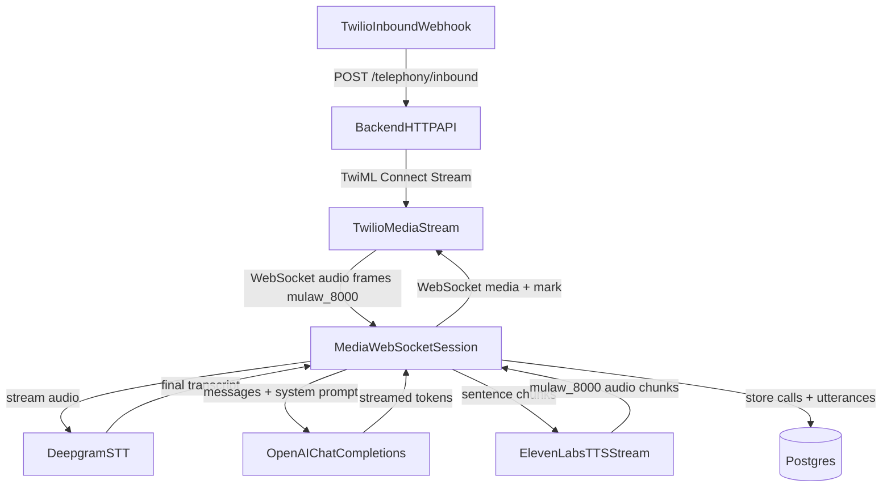
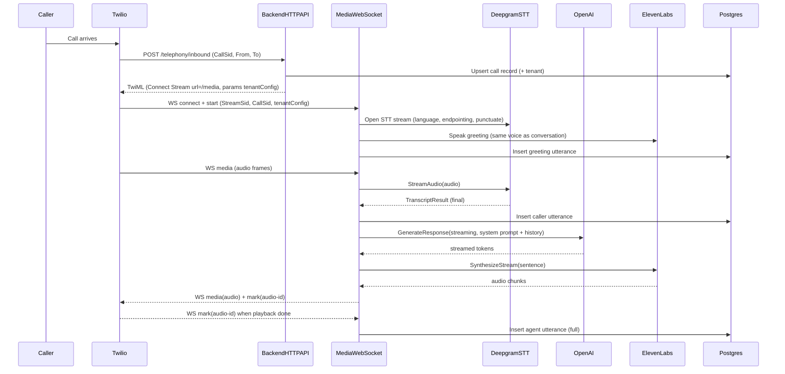

# Voice agent flow (Twilio → STT → LLM → TTS) — current behavior

This document describes how the **voice assistant** works end-to-end, including the latest fixes for smoother turn-taking (barge-in, response cancellation, and “hang up after audio finishes” reliability).

## Components

- **Twilio Voice Webhook**: starts the call and returns TwiML that connects a **Media Stream** to our backend.
- **Backend HTTP API**: Go service handling Twilio webhooks and the Media Stream websocket.
- **Deepgram (STT)**: streaming speech-to-text from Twilio μ-law audio.
- **OpenAI (LLM)**: generates the assistant text response (streaming).
- **ElevenLabs (TTS)**: converts assistant text to μ-law audio and streams it back to Twilio.
- **Postgres**: stores call records and utterances for replay/analysis.
- **Traefik (Coolify proxy)**: routes `api.zvednu.cz` to the backend container.

## Runtime endpoints

- **Inbound call webhook**: `POST /telephony/inbound`
- **Call status webhook**: `POST /telephony/status`
- **Media Stream websocket**: `GET /media`
- **Health**: `GET /healthz`

## High-level flow

## Sequence diagram (single turn)

## Turn-taking & smoothness features

### 1) Endpointing (how we detect the caller “finished speaking”)

Deepgram endpointing controls how long silence is required before Deepgram emits end-of-speech. Too low fragments the caller; too high feels slow.

- **Default**: `STT_ENDPOINTING_MS` (env), clamped to `[200..4000]`
- **Tenant override**: `tenantConfig.endpointing` (if provided)

Where it’s applied:
- Backend opens Deepgram stream with `Endpointing` (ms).

### 2) Turn finalization (avoid replying “after half a sentence”)

Deepgram can return multiple **final segments** inside one spoken user turn. The important distinction:

- `is_final`: **segment final** (there may be several per user turn)
- `speech_final`: **end-of-speech** (this is the real “user finished speaking” signal)

**Current implementation**:

- We only finalize a caller utterance (store + start LLM) on **`speech_final`**, not on `is_final`.
- After `speech_final` we wait a short **grace window (250ms)** to allow late-arriving final segments to be appended before triggering the LLM.

This prevents the assistant from responding after “half a sentence” and then asking a follow-up when the rest of the sentence arrives.

### 3) Barge-in (caller interrupts while assistant is speaking)

When a final caller utterance arrives while the assistant has **audio in-flight** or an **active response**, we treat it as barge-in:

- Send Twilio `clear` to stop current playback.
- Cancel the currently active response context (stops:
  - ongoing LLM streaming
  - ongoing TTS streaming
  - ongoing audio send loop)
- Cancel any pending post-audio action (hang-up / forward), so a previous “goodbye” can’t cut off a continuing conversation.

Additionally, we detect barge-in **early** (as soon as any non-empty transcript arrives) so playback stops immediately and we don’t talk over the caller.

### 4) Response cancellation & concurrency safety

Every user utterance starts a new “response session” with its own cancelable context:

- Starting a new response cancels the previous one.
- All streaming loops check context cancellation and stop fast.
- Conversation `messages` are snapshot for the LLM call to avoid data races.

### 5) Audio “speaking” tracking via mark IDs

We send Twilio `mark` events after each TTS segment, named:

- `audio-<id>` where `<id>` is a monotonic counter.

We track:
- how many marks are outstanding (`audioPending`)
- which mark corresponds to “the last segment of the response” (`pendingDoneMarkID`)

This enables reliable “do X after audio finishes”, especially when TTS is sentence-chunked.

### 6) Hang up / forward after audio finishes (and only the right audio)

If the response contains:
- a **goodbye** (e.g. “na shledanou”), or
- a **forward marker** (`[PŘEPOJIT]`)

then we:
- record the mark ID for the last spoken segment of that response,
- wait for that mark to be received (or timeout),
- then call Twilio REST API to hang up or forward.

Important: pending hangup/forward is **cancelled** on barge-in / new caller speech.

### 7) Filler words (latency masking)

Filler words are short Czech acknowledgements (e.g. “Rozumím...”).

Current behavior:
- We wait briefly for LLM output.
- Only if the model is slow (no tokens yet) we may speak a filler, subject to:
  - random skip probability
  - cooldown (avoid repetition)
  - skip for very short caller utterances

### 8) Debug logging: turn IDs and response IDs

To debug turn-taking issues, logs include:

- `caller said (turn=<n>)` — finalized user turn (after `speech_final` + grace)
- `starting response (turn=<n> resp=<m>)` — the LLM/TTS response spawned for that turn

This makes it easy to verify: **one user turn → one response**, and to spot any accidental double-trigger.

## Prompt guardrails (to reduce “not smooth” conversations)

We apply guardrails to the system prompt so the model:
- asks **one question per turn**,
- asks for **purpose first**, then **name**,
- keeps responses short.

These guardrails are prepended to the system prompt even if the tenant provides a custom prompt.

## Data storage (what gets recorded)

In Postgres we store:
- `calls`: provider call ID, timestamps, status, tenant linkage, ended_by.
- `call_utterances`: ordered transcript with speaker, text, STT confidence, interrupted flag.
- `call_screening_results`: post-call analysis (classification + entities).

This enables replaying the last N calls and debugging “smoothness” issues.

## Deployment note: Traefik routing for `api.zvednu.cz`

Backend is attached to both:
- an internal DB network, and
- the `coolify` network (for Traefik).

Traefik must be told which network to use, otherwise it may select the internal IP and time out:

- `traefik.docker.network=coolify`

## Relevant code locations

- Twilio inbound webhook: `backend/internal/httpapi/twilio_handlers.go`
- Media WS session: `backend/internal/httpapi/media_ws.go`
- STT client: `backend/internal/stt/deepgram.go`
- LLM client/prompt: `backend/internal/llm/openai.go`, `backend/internal/llm/prompts.go`
- TTS client: `backend/internal/tts/elevenlabs.go`
- Env/config: `backend/internal/app/config.go`, `backend/env.example`
- Production compose: `deploy/docker-compose.coolify.yml`

